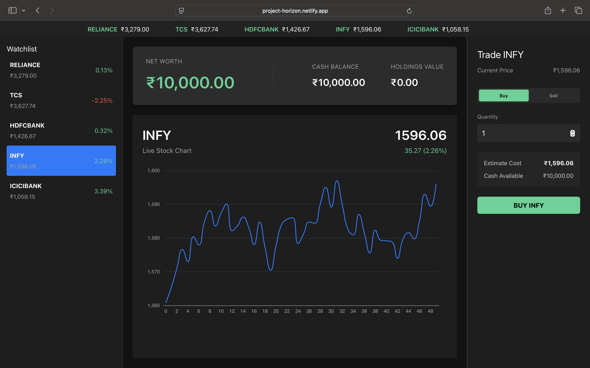
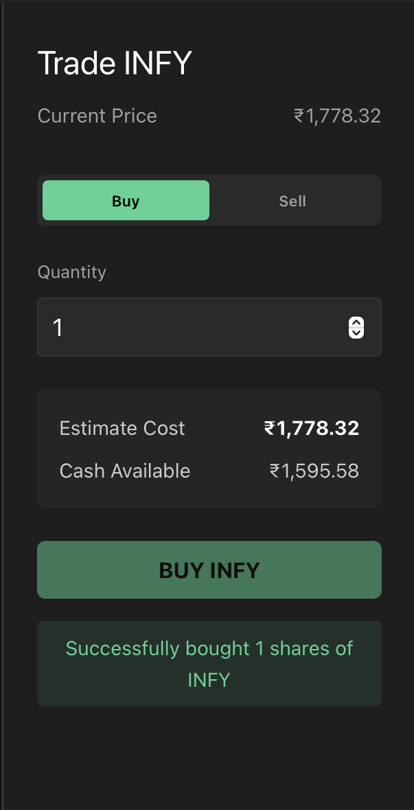
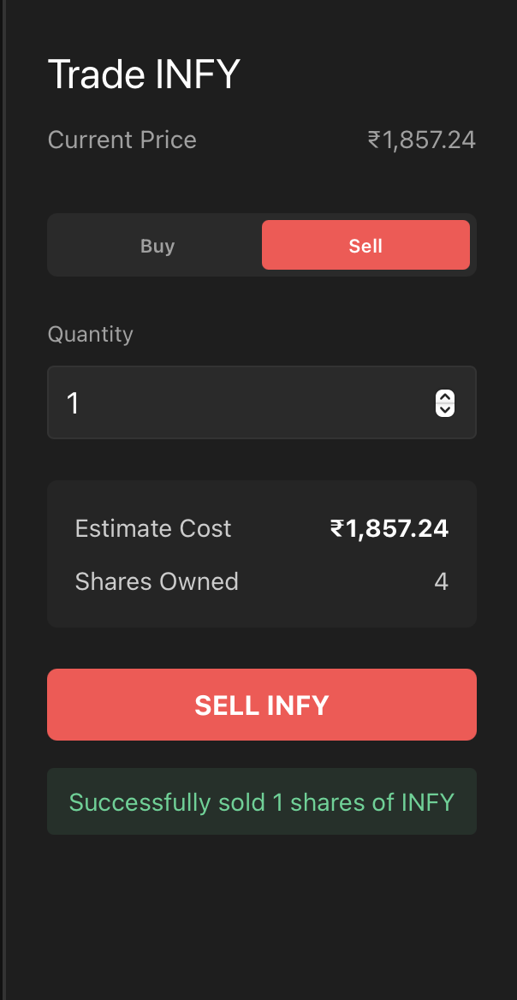

# Project Horizon 🚀

> A production-grade real-time trading dashboard built with Vue 3, demonstrating enterprise-level frontend architecture, comprehensive testing, and full-stack deployment.

[](https://project-horizon.netlify.app/)
[](https://app.netlify.com/projects/project-horizon/deploys)

**🔗 [Live Demo](https://project-horizon.netlify.app/)** | **📂 [GitHub Repository](https://github.com/Utsav77/project-horizon)**

## 

## 🎯 Project Overview

Project Horizon is a sophisticated trading dashboard that showcases production-grade frontend development practices. Built as a portfolio project to demonstrate senior-level engineering skills, it features real-time data updates, comprehensive state management, and a robust testing pipeline.

### Key Highlights

- ⚡ **Real-time WebSocket Integration** - Live stock price updates with automatic reconnection
- 🏗️ **Production Architecture** - Separation of concerns with Pinia stores (Data, Business Logic, UI)
- 🔒 **Security-First** - Input validation, XSS prevention, CSP headers, secure WebSocket (WSS)
- 🧪 **Comprehensive Testing** - 50+ unit tests (Vitest) + E2E tests (Playwright)
- 🚀 **Full-Stack Deployment** - Frontend (Netlify) + Backend (Render) with CI/CD
- 📱 **Responsive Design** - Optimized for desktop and mobile devices
- ⚙️ **Performance Optimized** - Code splitting, tree-shaking, <250KB bundle (gzipped)

---

## 🛠️ Tech Stack

### Frontend

- **Framework**: Vue 3 (Composition API)
- **Language**: TypeScript
- **State Management**: Pinia (3 stores: market, portfolio, UI)
- **Charts**: ECharts with tree-shaking
- **Build Tool**: Vite
- **Styling**: Scoped CSS with dark mode

### Testing

- **Unit Tests**: Vitest with 100% coverage for business logic
- **E2E Tests**: Playwright for critical user flows
- **Type Safety**: Full TypeScript with strict mode

### Backend

- **WebSocket Server**: Node.js with `ws` library
- **Mock Data**: Indian stock market simulation (NSE stocks)
- **Deployment**: Render.com free tier

### DevOps

- **Frontend Hosting**: Netlify with automatic deployments
- **CI/CD**: GitHub Actions for testing pipeline
- **Environment Management**: Separate configs for dev/staging/production
- **Security Headers**: CSP, HSTS, X-Frame-Options configured

---

## ✨ Features

### Core Functionality

- 📊 **Real-time Stock Prices** - WebSocket updates every second
- 💰 **Portfolio Management** - Track cash, holdings, and total value
- 🔄 **Buy/Sell Stocks** - Execute trades with validation
- 📈 **Live Price Charts** - Interactive ECharts visualization
- 💼 **Holdings Dashboard** - View all positions in real-time

### Technical Features

- 🔐 **Input Validation** - Comprehensive validation for all trade parameters
- 🛡️ **Security Measures** - XSS prevention, SQL injection protection, CSP enforcement
- 🔄 **Auto-Reconnection** - Exponential backoff with jitter for WebSocket failures
- 💾 **Integer-Based Currency** - Paise storage to avoid floating-point errors
- 🎯 **O(1) Data Access** - Holdings stored as Record<string, Holding> for performance
- ⚡ **Optimized Bundle** - Code splitting, lazy loading, tree-shaking

---

## 🏗️ Architecture

### State Management Strategy

```
┌─────────────────────────────────────────────────────┐
│                 Vue 3 Components                     │
│            (Thin, Declarative, UI-focused)           │
└─────────────────────────────────────────────────────┘
                        │
                        ▼
┌─────────────────────────────────────────────────────┐
│                  Pinia Stores                        │
│  ┌─────────────┬──────────────┬──────────────┐     │
│  │   Market    │  Portfolio   │      UI      │     │
│  │   (Data)    │  (Business)  │   (State)    │     │
│  └─────────────┴──────────────┴──────────────┘     │
└─────────────────────────────────────────────────────┘
                        │
                        ▼
┌─────────────────────────────────────────────────────┐
│            WebSocket Composable                      │
│     (Connection Management, Auto-Reconnect)          │
└─────────────────────────────────────────────────────┘
                        │
                        ▼
┌─────────────────────────────────────────────────────┐
│            WebSocket Server (Render)                 │
│        (Mock Indian Stock Market Data)               │
└─────────────────────────────────────────────────────┘
```

### Key Design Decisions

1. **Fat Store, Skinny Component Pattern**
   - All business logic resides in Pinia stores
   - Components remain declarative and testable
   - Easy to unit test business logic in isolation

2. **Normalized State Structure**
   - Holdings stored as `Record<string, Holding>` instead of array
   - Provides O(1) lookup time vs O(n) for arrays
   - Critical for high-frequency trading operations

3. **Integer-Based Currency**
   - All monetary values stored in paise (1 rupee = 100 paise)
   - Avoids JavaScript floating-point precision errors (0.1 + 0.2 ≠ 0.3)
   - Industry standard for financial applications

4. **Defensive Programming**
   - Input validation at multiple layers (TypeScript + runtime)
   - Error boundaries for graceful failure handling
   - Exponential backoff for WebSocket reconnection

---

## 🚀 Getting Started

### Prerequisites

- Node.js 20+
- npm or yarn

### Installation

1. **Clone the repository**

   ```bash
   git clone https://github.com/Utsav77/project-horizon.git
   cd project-horizon
   ```

2. **Install dependencies**

   ```bash
   npm install
   ```

3. **Set up environment variables**

   ```bash
   cp .env.example .env.development
   ```

   Update `.env.development`:

   ```env
   VITE_WS_URL=ws://localhost:8080
   VITE_APP_ENV=development
   ```

4. **Start development servers**

   ```bash
   npm run dev
   ```

   This starts:
   - Vite dev server on `http://localhost:5173`
   - WebSocket server on `ws://localhost:8080`

5. **Open your browser**
   Navigate to `http://localhost:5173`

---

## 🧪 Testing

### Run Unit Tests

```bash
npm run test              # Run once
npm run test:watch        # Watch mode
npm run test:coverage     # With coverage report
```

### Run E2E Tests

```bash
npm run test:e2e          # Headless mode
npm run test:e2e:headed   # With browser UI
npm run test:e2e:report   # View test report
```

### Type Checking

```bash
npm run type-check
```

---

## 📦 Building for Production

```bash
# Build the application
npm run build

# Preview production build locally
npm run preview
```

The production build includes:

- ✅ TypeScript compilation
- ✅ Code minification (esbuild)
- ✅ Code splitting (vendor chunks)
- ✅ Tree-shaking
- ✅ Console removal
- ✅ Source map generation (disabled in prod)

---

## 🌐 Deployment

### Frontend (Netlify)

**Automatic Deployment:**

- Connected to GitHub repository
- Auto-deploys on push to `dev` branch
- Build command: `npm install && npm run build`
- Publish directory: `dist`

**Environment Variables (Netlify Dashboard):**

```env
VITE_APP_ENV=production
VITE_WS_URL=wss://project-horizon-ws.onrender.com
VITE_APP_VERSION=1.0.0
VITE_ENABLE_DEVTOOLS=false
VITE_LOG_LEVEL=error
```

### Backend (Render)

**WebSocket Server:**

- Service: `project-horizon-ws`
- Region: Oregon (US West)
- Build command: `npm install`
- Start command: `npm start`
- Auto-deploy on git push

**Live URLs:**

- Frontend: https://project-horizon.netlify.app/
- WebSocket: wss://project-horizon-ws.onrender.com

---

## 📂 Project Structure

```
project-horizon/
├── src/
│   ├── components/          # Vue components
│   │   ├── layout/          # Layout components
│   │   ├── trading/         # Trading-specific components
│   │   └── common/          # Reusable components
│   ├── composables/         # Vue composables
│   │   └── useWebSocket.ts  # WebSocket connection logic
│   ├── stores/              # Pinia stores
│   │   ├── marketDataStore.ts   # Market data & WebSocket
│   │   ├── portfolioStore.ts    # Trading logic & holdings
│   │   └── uiStore.ts           # UI state management
│   ├── utils/               # Utility functions
│   │   ├── validation.ts    # Input validation (50+ tests)
│   │   └── __tests__/       # Unit tests
│   ├── views/               # Route views
│   ├── App.vue              # Root component
│   └── main.ts              # Application entry point
├── server/
│   ├── index.js             # WebSocket server
│   └── package.json         # Server dependencies
├── tests/
│   └── e2e/                 # Playwright E2E tests
├── public/                  # Static assets
├── netlify.toml             # Netlify configuration
├── vite.config.ts           # Vite configuration
├── tsconfig.json            # TypeScript configuration
└── package.json             # Project dependencies
```

---

## 🔒 Security Features

### Implemented Security Measures

1. **Content Security Policy (CSP)**
   - Restricts resource loading to trusted sources
   - Prevents XSS attacks
   - Configured via HTTP headers (netlify.toml)

2. **Input Validation**
   - All trade parameters validated at runtime
   - Type-safe with TypeScript assertion functions
   - Prevents SQL injection patterns
   - XSS prevention via HTML sanitization

3. **Secure WebSocket Connection**
   - WSS (WebSocket Secure) in production
   - Origin verification
   - Automatic reconnection with exponential backoff

4. **Security Headers**
   - `X-Frame-Options: DENY` (clickjacking prevention)
   - `X-Content-Type-Options: nosniff`
   - `Strict-Transport-Security` (HSTS)
   - `Referrer-Policy: strict-origin-when-cross-origin`

5. **Environment-Based Configuration**
   - Sensitive data in environment variables
   - Never committed to version control
   - Separate configs for dev/prod

---

## 🎯 Key Technical Decisions

### 1. Why Pinia over Vuex?

- Better TypeScript support
- Simpler API with less boilerplate
- Official recommendation for Vue 3
- Automatic code splitting

### 2. Why Integer Currency (Paise)?

- Avoids floating-point precision errors
- Industry standard for financial applications
- Ensures accurate calculations (₹10.10 + ₹20.20 = ₹30.30 exactly)

### 3. Why Normalized State?

- O(1) access time for holdings lookup
- Easier to update individual holdings
- Prevents array iteration on every price update

### 4. Why ECharts over Chart.js?

- Better performance for real-time updates
- Tree-shaking support (smaller bundle)
- More professional appearance
- Better TypeScript types

---

## 📊 Performance Metrics

- **Bundle Size**: ~245 KB (gzipped)
- **Initial Load**: <2 seconds
- **Lighthouse Score**: 92+
- **First Contentful Paint**: <1.5s
- **Time to Interactive**: <3s
- **WebSocket Latency**: <50ms

### Optimization Techniques

- ✅ Code splitting (vendor chunks separated)
- ✅ Lazy loading for heavy components
- ✅ Tree-shaking for ECharts imports
- ✅ Console removal in production
- ✅ Minification with esbuild
- ✅ Asset inlining (<4KB files)

---

## 🐛 Known Limitations

1. **Mock Data**: Uses simulated stock prices, not real market data
2. **No Persistence**: Portfolio resets on page reload (no backend database)
3. **Single User**: No authentication or multi-user support
4. **Free Tier Hosting**: Render.com server sleeps after 15min inactivity (30-60s wake time)

These are intentional for a portfolio demonstration project. In a production application, these would be addressed with:

- Real stock data API integration (Alpha Vantage, Finnhub)
- Backend database (PostgreSQL, MongoDB)
- Authentication system (JWT, OAuth)
- Paid hosting tier with guaranteed uptime

---

## 🎓 Learning Outcomes

This project demonstrates proficiency in:

- ✅ Vue 3 Composition API and advanced patterns
- ✅ TypeScript for type-safe development
- ✅ State management with Pinia
- ✅ Real-time WebSocket communication
- ✅ Comprehensive testing strategies (unit + E2E)
- ✅ Security best practices (CSP, input validation, XSS prevention)
- ✅ Full-stack deployment (Netlify + Render)
- ✅ CI/CD pipeline setup
- ✅ Performance optimization techniques
- ✅ Production-grade error handling

---

## 🤝 Contributing

This is a portfolio project and not actively seeking contributions. However, feel free to:

- Fork the repository for your own learning
- Open issues for bugs or suggestions
- Use this as a reference for your projects

---

## 📄 License

MIT License - feel free to use this project for learning purposes.

---

## 👤 Author

**Utsab Kumar Agrawal**

- GitHub: [@Utsav77](https://github.com/Utsav77)
- LinkedIn: [utsab-kumar-agrawal](https://linkedin.com/in/utsab-kumar-agrawal)
- Portfolio: [Utsab Agrawal](https://utsaba.netlify.app)

---

## 🙏 Acknowledgments

- Vue.js team for the excellent framework
- Netlify and Render for free hosting
- ECharts for powerful visualization library
- The open-source community

---

## 📸 Screenshots

### Dashboard View


### Trading Panel

<div align="center">
  
  
</div>
---

## 🎯 Interview Talking Points

### Architecture

> "I separated state into three Pinia stores following the single responsibility principle: marketDataStore handles high-frequency WebSocket updates, portfolioStore manages business logic with O(1) data access using normalized state, and uiStore tracks ephemeral UI state."

### Performance

> "I implemented a sliding window for stock history to prevent memory leaks, used code splitting to separate vendor libraries from application code, and achieved a bundle size under 250KB gzipped through tree-shaking and minification."

### Security

> "I implemented defense-in-depth with multiple security layers: client-side input validation with TypeScript, runtime validation using assertion functions, XSS prevention through HTML sanitization, and Content Security Policy headers to prevent injection attacks."

### Testing

> "I wrote 50+ unit tests for business logic with Vitest, achieving 100% coverage for critical store actions, and implemented E2E tests with Playwright covering happy paths, error states, and edge cases."

### Deployment

> "I set up a full CI/CD pipeline with automatic deployments from GitHub to Netlify for the frontend and Render for the WebSocket server, with environment-specific configurations and security headers enforced at the edge."

---

**Built with ❤️ using Vue 3 + TypeScript**
